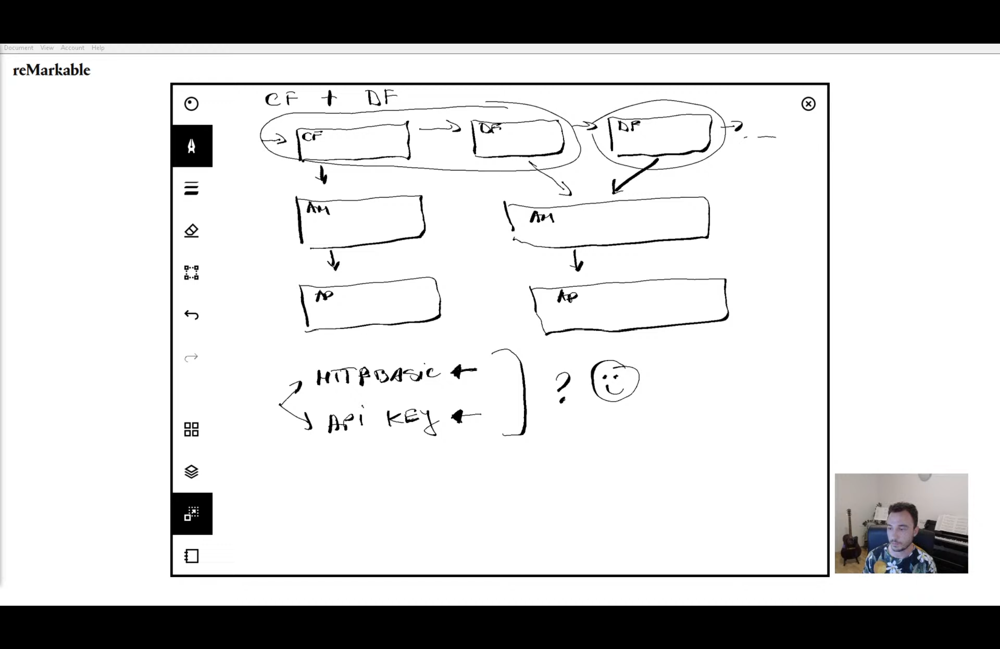

**Project Task**

```agsl
Implementing an application with both http basic and security key.
```

**Design Diagram**




**Having Two Security Filters (When my SpringBoot Application has more than one authentication)**

```agsl

(a)It is easier to work on this implementation when i have two Default filters from Spring Secirity.
This is because we shall just have one authentication manager and one authentication provider.

The above can be said when i as well have two custom filters.

```

**Http Security Object**

```agsl
The httpSecurity Bean that is in the context comes with all the methods that i need to implement spring security

When http basic is called from http, it creates a configurer and when the application starts
a http basic filter,manager and provider are created.every method that i add after http helps in configuring something

The Http security object is very important, it is how spring security knows how to build the entire
security design that i have defined.

```

**Filters**

```agsl

For every form of authentication,filters come in very handy.

if i have 2 types i will have two filters .

inside filter (Manager, the manager calls the provider, the provider may use the user details, if the 
request credenitals are correct the provider then tells the manager and then the filter calls the next one)
```
**Authenitication provider**

```agsl

It has the responsibility of implementing spring security logic.

```
